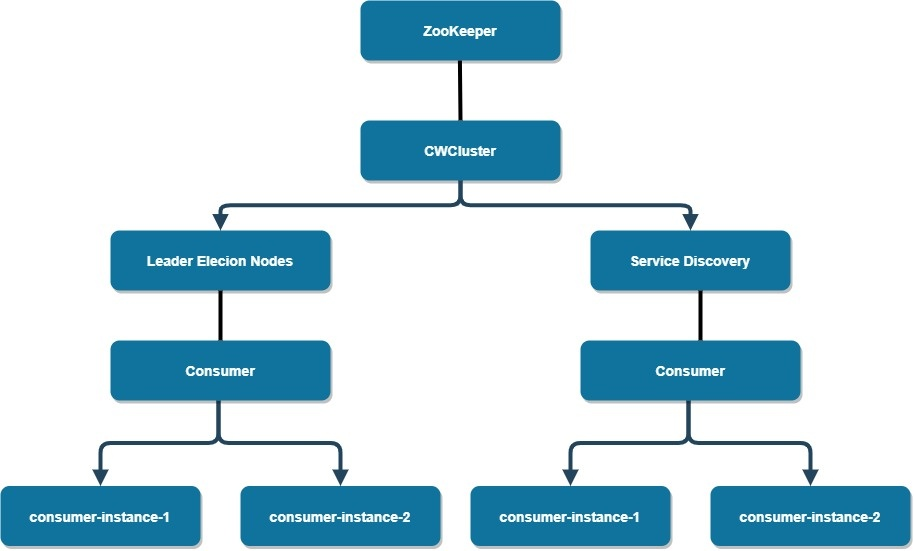

# Commons cluster
Commons cluster utils.

**Note**: This is not an official Cisco product.

## Introduction
Provides capabilities for clustering features for managing multiple instances services like Service Discovery and Leader Election, subscribing to instance up/down events, and sending messages to application instances.
The library is implemented with Curator on top of Apache ZooKeeper.
Main purpose is Leader Election algorithm, with eliminating the "herd" effect.

## ZooKeeper Nodes Diagram


[clustering_library.drawio](./docs/clustering_library.drawio)

## Getting Started
### Functionality
* Each service instance registered itself by joining the cluster.
* Leader elected and starts listening to stateChanged events for added/removed instances.
* Consumer can implement event listener with the below methods.
    * takeLeadership - Called for the leader, when leader is taking leadership.
    When implementing takeLeadership, leadershipLost should normally also be implemented.
    * leadershipLost - Called for the leader, when leadership is lost when connection suspended or lost.
    * stateChanged - Called for the leader only, when cluster state changed, for example some instance added or removed.
    When number of instances equals expectedNumberOfInstances (optional constructor parameter), it is triggered immediately.
    Otherwise, it is triggered after a grace period. This is to fine-grain scenarios like herd effect on initial cluster startup when all service instances start together.
    * onMessage - Called for message received, for the target instance.

  takeLeadership(), leadershipLost() and stateChanged() events have no data.
  The consumer can query getClusterMembers() in the implementation of the event listener and get the needed data.
  Reg. the 'state':
  takeLeadership - occurs only for leader, such as initial cluster startup or leader down and new leader took its place, and only leader listens for stateChanged() events - so "state" is always leader. The meaning, is that possibly other non-leader service instance was added/removed.  
  Note:
  when 2 instances join in short latency, cluster state event change by stateChanged() may not occur, but instead, the takeLeadership() would have the 2 instances already ready.

* Messaging - sendMessage to target instance and receiving it with the event listener onMessage().  
  Note regarding messaging:
  Messaging capabilities are basic and minimal and not recommended for every application use, as it is based on ZooKeeper, where messaging is not its main target.
  
### Basic Usage Example

```
ClusterEventListener eventListener = new ClusterEventListener() {

@Override
public void takeLeadership() {
    log.info("Set as active / leader.");
    // can query getClusterMembers() for data
}

@Override
public void leadershipLost() {
    log.info("leadership lost. Moving to follower state.");
    // Consumer specific logic.
}

@Override
public void stateChanged() {
    log.info("State changed (e.g. follower added / removed).");
    // can query getClusterMembers() for data
}

@Override
public void onMessage(String message) {
    log.info("Got message: {}", message);
    // Consumer specific logic.
}

};


ClusterController clusterController = ClusterController.builder().appId(appId).eventListener(eventListener)
	.expectedNumberOfInstances(2).zkHost(zkHost).zkPort(zkPort).host(instanceHost).build();
clusterController.joinCluster();

String targetHost = null;
List<ClusterMember> instances = clusterController.getClusterMembers();
for (ClusterMember clusterMember : instances) {
    if (!clusterController.getClusterMember().getMemberName().equals(clusterMember.getMemberName())) {
         targetHost = clusterMember.getMemberName();
         break;
    }
}

log.info("sending message");
InstanceMessage instanceMessage= new InstanceMessage();
instanceMessage.setTargetHost(targetHost);
instanceDetails.setSourceHost(clusterController.getClusterMember().getMemberName());
instanceMessage.setData("test-message1 sent to " + targetHost);
clusterController.sendMessage(instanceMessage);


// Should be called at application shutdown
clusterController.shutdown();
```

### Full test example
Full unit test is implemented. It is using embedded in-process ZooKeeper server provided by Curator framework.

See ClusterControllerTest class.

## ZooKeeper Nodes - CLI

```
*[zk: localhost:2181(CONNECTED) 1] ls /commons-cluster*

*[leader\_election\_nodes, service\_discovery]*

*[zk: localhost:2181(CONNECTED) 2] ls /commons-cluster/service\_discovery*

*[example-service]*

*[zk: localhost:2181(CONNECTED) 3] ls /commons-cluster/service\_discovery/example-service*

*[example-service-0, example-service-1]*

*[zk: localhost:2181(CONNECTED) 4] ls /commons-cluster/leader\_election\_nodes*

*[example-service]*

*[zk: localhost:2181(CONNECTED) 5] ls /commons-cluster/leader\_election\_nodes/example-service*


*[\_c\_7b23eb48-192a-417d-b449-d4f740a472eb-latch-0000000000, \_c\_ae317765-8257-4e85-ba3f-236c0aec84f5-latch-0000000001]*
```

## Contributions
 * [Contributing](CONTRIBUTING.md) - how to contribute.
 * [Contributors](docs/CONTRIBUTORS.md) - Folks who have contributed, thanks very much!

## Licensing

```

Licensed under the Apache License, Version 2.0 (the "License");
you may not use this file except in compliance with the License.
You may obtain a copy of the License at

    http://www.apache.org/licenses/LICENSE-2.0

Unless required by applicable law or agreed to in writing, software
distributed under the License is distributed on an "AS IS" BASIS,
WITHOUT WARRANTIES OR CONDITIONS OF ANY KIND, either express or implied.
See the License for the specific language governing permissions and
limitations under the License.
```

### Authors
Liran Mendelovich 

Cisco 
